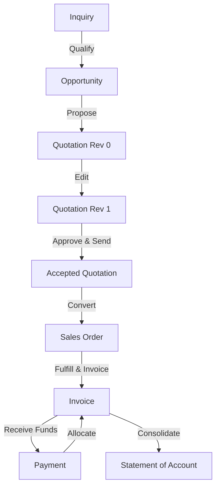

# System Workflows

The Chivon Mechanical application is built around a linear, strict business workflow designed to prevent data duplication and ensure financial traceability.

## Core Sales & Finance Workflow

### 1. Inquiry to Opportunity
- An **Inquiry** is a raw lead.
- If qualified, it is converted to an **Opportunity**. The Inquiry status becomes `CONVERTED`, and a link is established to the new Opportunity.

### 2. Quotations and Revisions
- An Opportunity generates a **Quotation**.
- Quotations use a Revision engine.
- Every edit or "Create Revision" action creates a new `QuotationRevision`.
- Only one revision is marked `isCurrent`.
- Only the `isCurrent` revision can be Sent, Approved, or Converted.

### 3. Sales Orders
- An accepted Quotation is converted to a **Sales Order (SO)**.
- Customer and Product records are never duplicated during conversion; they are linked by reference.
- The SO tracks `orderedQty`, `fulfilledQty`, and `invoicedQty` per line item.

### 4. Invoicing
- An **Invoice** must have a source (either a Quotation or a Sales Order). Free-standing invoices are blocked.
- **Partial Invoicing:** You can invoice part of a Sales Order. The system blocks over-invoicing (you cannot invoice more than the `orderedQty`).

### 5. Payments
- A single **Payment** can be allocated across multiple Invoices (one-to-many).
- A single Invoice can be paid off via multiple Payments (many-to-one).
- Payments cannot be hard-deleted. To fix a mistake, a Payment must be **Reversed**, which restores the Invoice outstanding balance and creates an audit trail.

### 6. Statement of Account (SOA)
- The SOA dynamically computes the closing balance based on the Customer's Opening Balance, plus all Invoices, minus all Payments and Credit Notes within a specific date range.
